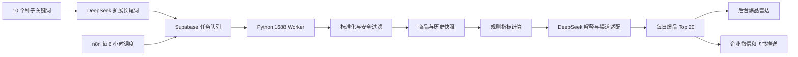

# 1688 爆品雷达自动化设计

## 1. 目标

在现有 AI 选品中台中增加一套轻量级 1688 自动监控能力，实现：

- 维护 10 个种子关键词，并由 DeepSeek 扩展同义词和长尾词。
- 每个关键词最多采集前 50 个公开商品。
- 每 6 小时生成一次商品观测快照。
- 每日生成爆品潜力 Top 20。
- 在后台“爆品雷达”页面展示结果。
- 将同一份榜单摘要推送到企业微信和飞书机器人。
- 为小红书和闲鱼选品、定价及内容生产提供依据。

第一阶段不支持自动发布、自动下单、自动采购，也不绕过登录、验证码或平台访问限制。

## 2. 范围与约束

### 2.1 第一阶段范围

- 数据源仅限 1688。
- 仅访问无需登录的公开商品和公开搜索/类目页面。
- 每 6 小时运行一次，规模为 10 个种子关键词、每词前 50 个商品。
- 用户可手动点击“一键采集”，也可等待定时任务。
- 结果面向小红书与闲鱼两个下游渠道。
- 所有进入内容生产的商品仍沿用现有人工审核流程。

### 2.2 明确不做

- 不同时接入淘宝、天猫、拼多多或抖音。
- 不建设 Redis、Celery 或多 Worker 集群。
- 不根据未公开数据猜测销量、评价或库存。
- 不自动处理验证码、登录验证或风控页面。
- 不改造现有功能目录和业务分层。

## 3. 架构

采用 n8n、Supabase 任务队列和 Python Worker 的混合架构：

### 3.1 组件职责

- **n8n**：创建定时任务、触发每日榜单计算、调用通知 Webhook。
- **Supabase**：保存关键词、任务、商品、快照、评分和通知状态，并承担轻量任务队列。
- **Python Worker**：领取任务、访问公开页面、解析商品、限速、重试、清洗和安全过滤。
- **Next.js 后台**：配置关键词、手动触发、查看任务状态和榜单、将候选商品加入现有产品池。
- **DeepSeek**：扩展关键词、解释分数、生成小红书和闲鱼渠道建议；不直接决定数字评分。

### 3.2 数据源适配

采集层使用 `1688Provider` 边界隔离数据来源。第一阶段实现公开页面 Provider；若后续获得并核实 1688 官方 API 权限，可增加官方 API Provider，而不改变任务、存储和评分接口。

## 4. 数据模型

保留现有 `products`、`data_snapshots` 等业务表，并新增以下最小表：

### 4.1 `monitor_keywords`

- 种子关键词及 AI 扩展关键词。
- 记录来源、父关键词、启用状态和最近成功时间。
- 最多启用 10 个种子关键词；扩展词属于对应种子词。

### 4.2 `crawl_jobs`

- 记录采集周期、关键词、任务状态、锁定 Worker、尝试次数和错误原因。
- 状态为 `pending`、`running`、`succeeded`、`failed` 或 `paused`。
- 同一采集周期和关键词只创建一个任务。

### 4.3 `product_observations`

- 每 6 小时保存商品可见指标。
- 包含价格、起订量、搜索位置、供应商公开信息、页面状态和采集时间。
- 保存原始指标 JSON，便于后续增加字段。
- 使用 1688 `offer_id` 和观测时间窗口去重。
- 原始观测数据默认保留 30 天。

### 4.4 `hot_product_scores`

- 保存每日评分、排名、评分拆解、可信度和 AI 解释。
- 同一商品每天最多一条评分。
- 保存小红书和闲鱼的建议售价、利润空间及渠道适配建议。

### 4.5 `notification_configs` 与通知记录

- 保存企业微信和飞书 Webhook 配置。
- Webhook 只保存在服务端，不回显完整值。
- 记录推送渠道、榜单日期、响应状态、尝试次数和错误原因。

## 5. 数据流

### 5.1 首次启动

1. 用户填写并启用最多 10 个种子关键词。
2. DeepSeek 为每个种子词生成受限数量的同义词和长尾词。
3. 系统保存扩展词，用户可以停用不需要的词。
4. 用户点击“一键采集”，n8n 为启用关键词创建任务。
5. Python Worker 领取任务并采集每词前 50 个公开商品。
6. 系统按 `offer_id` 去重，写入商品与首个观测快照。
7. 首日生成“初始潜力榜”，并标记低或中可信度。

### 5.2 定时运行

1. n8n 每 6 小时为启用关键词创建增量任务。
2. Worker 更新商品数据并新增观测快照。
3. 每日固定时间运行规则评分，生成 Top 20。
4. DeepSeek只解释分数变化并生成渠道建议。
5. 榜单写入后台并推送企业微信和飞书。

### 5.3 可信度阶段

- 只有一次观测时显示初始潜力，不声称存在趋势。
- 至少三次观测后计算短期趋势。
- 累积七天数据后标记为高可信度趋势评分。
- 缺失指标不补造数据，对应维度降权并降低总体可信度。

## 6. 爆品潜力评分

总分为 100 分，由确定性规则计算：

| 维度 | 权重 | 核心依据 |
| --- | ---: | --- |
| 趋势增速 | 35 | 搜索位置变化、价格变化及公开指标的增量 |
| 关键词需求与榜单位置 | 20 | 多关键词覆盖、搜索结果位置及持续出现次数 |
| 竞争拥挤度 | 15 | 同质商品数量、标题和图片相似度、供应商集中度 |
| 渠道利润空间 | 15 | 1688 成本、起订量、小红书/闲鱼建议售价和费用预留 |
| 供应商可靠度 | 10 | 页面公开的经营、履约及资质信息 |
| 内容适配与合规 | 5 | 小红书内容表现空间、闲鱼转售适配及风险过滤结果 |

规则引擎输出数字分数和维度分。DeepSeek接收评分结果与已采集事实，只生成上涨原因、风险提示和渠道建议，不修改规则分数。

## 7. 任务锁与错误处理

- Worker 领取任务时设置锁和锁超时，避免重复执行。
- 单商品失败不终止整个关键词任务。
- 网络超时和临时错误最多重试三次，采用递增等待。
- 页面结构变化、验证码或登录拦截立即停止对应任务，不尝试绕过。
- 连续失败的关键词自动暂停，并保留最后错误和失败次数。
- 通知失败只重试通知，不重新抓取或重新评分。
- 推送失败时榜单仍保存在后台。
- 同一商品在同一采集周期内只写入一个快照。
- 后台显示最近执行时间、下一次执行时间、成功率、失败数和错误原因。

## 8. 后台体验

新增“爆品雷达”页面，保持现有后台的紧凑运营工具风格。

### 8.1 监控控制区

- 管理 10 个种子关键词和扩展词启停状态。
- 显示监控总开关、下一次执行时间和“一键采集”按钮。
- 显示当前任务的待执行、运行中、成功和失败数量。

### 8.2 Top 20 榜单

- 展示排名、潜力分、可信度、24 小时趋势、7 天趋势和成本。
- 展示小红书与闲鱼建议售价、利润空间和适配结论。
- 支持查看历史曲线和评分拆解。
- 支持加入产品池、生成内容和忽略商品。
- “生成内容”继续进入现有人工审核队列。

### 8.3 通知配置

- 在设置页增加企业微信和飞书 Webhook。
- 提供测试推送按钮和最近推送状态。
- Webhook 不发送到浏览器日志，也不包含在普通设置查询响应中。

## 9. 安全与合规

- 只采集无需登录的公开页面。
- 设置低并发、请求间隔和单周期上限。
- 不绕过验证码、风控、登录或其他访问控制。
- 保留现有仿牌、医疗、减肥、保健品和三无产品过滤。
- 被安全规则拦截的商品不进入 Top 20，也不自动生成内容。
- Service Role Key、DeepSeek Key 和通知 Webhook 仅在服务端使用。
- 所有自动生成内容必须经过人工审核，自动发布持续禁用。

## 10. 测试与验收

### 10.1 自动测试

- 关键词扩展结果校验与数量上限。
- 任务唯一性、锁领取、锁超时和重试。
- `offer_id` 去重和同周期快照唯一性。
- 缺失指标时的评分降权与可信度计算。
- Top 20 排序稳定性和安全商品过滤。
- 企业微信与飞书消息格式及独立重试。
- API 输入校验、密钥隐藏和数据库错误响应。

### 10.2 集成测试

- n8n 创建任务，Worker 领取并完成任务。
- 商品、观测、评分和通知记录写入 Supabase。
- DeepSeek 解释不能覆盖规则计算的数字分数。
- Worker 重启后超时任务可被重新领取。

### 10.3 浏览器验收

- 桌面和移动端均可管理关键词并触发采集。
- 一键启动后创建全部启用关键词任务。
- 每个关键词最多处理前 50 个商品并完成去重。
- 三次快照后出现趋势评分，每日生成 Top 20。
- 刷新页面或重启服务后任务和榜单仍存在。
- 失败任务显示关键词、错误原因和重试状态。
- 企业微信和飞书收到同一日期的榜单摘要。
- 加入产品池和生成内容仍需人工审核，不存在自动发布入口。

## 11. 交付边界

该设计作为一个独立实施阶段交付。实施顺序应为：先初始化 Supabase 现有 schema，再增加监控 schema 和任务 API；随后实现 Worker 与评分；最后接入 n8n、爆品雷达页面和通知。多平台、代理池和独立队列集群留待后续阶段评估。
