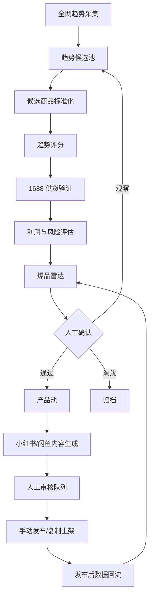

# 全网爆品雷达与 1688 供货验证设计

## 1. 目标

把当前项目从“1688 产品导入工具”升级为“全网爆品发现、1688 供货验证、多平台内容上架辅助工具”。

核心目标：

- 定时搜集公开平台上的热卖、爆火、增长趋势商品线索。
- 将不同来源的商品线索标准化为趋势候选商品。
- 用 1688 作为供货验证和成本核算平台，而不是唯一商品发现入口。
- 通过趋势、供货、利润、风险、内容适配度生成爆品雷达评分。
- 人工确认后进入产品池，再生成小红书、闲鱼等平台内容。
- 所有发布前动作保留人工审核，不做自动发布和自动下单。

## 2. 范围

### 2.1 第一阶段范围

- 新增“趋势候选池”，接收全网爆品线索。
- 支持手动录入、CSV 导入和 API 写入候选商品。
- 支持公开来源的基础趋势采集，优先选择无需登录、无需绕过风控的数据源。
- 支持 1688 关键词搜索或链接验证供货信息。
- 支持爆品雷达评分和人工确认进入产品池。
- 支持小红书、闲鱼内容草稿生成，并进入现有审核队列。
- 支持发布后数据手动或 API 回流，用于复盘和放量判断。

### 2.2 第一阶段不做

- 不绕过登录、验证码、风控或平台访问限制。
- 不自动发布到小红书、闲鱼或其他平台。
- 不自动下单、采购或付款。
- 不把未验证的 1688 结果伪装成成功提取。
- 不把所有采集到的商品直接放入产品池。
- 不接入需要复杂授权或高风险爬取的平台私有数据。

## 3. 核心流程

## 4. 模块设计

### 4.1 全网趋势采集

职责：

- 从公开平台收集热卖、爆火、增长趋势商品线索。
- 记录来源平台、关键词、排名、热度指标、页面链接、截图或原始摘要。
- 对采集失败、访问受限、结构变化做明确标记。

优先数据源：

- 小红书公开搜索结果、热门笔记线索。
- 抖音、快手、TikTok 等公开热视频和商品关键词线索。
- 淘宝、天猫、拼多多、京东等公开榜单或热搜页面。
- 闲鱼公开搜索结果、转卖频率和价格带线索。
- Google Trends、Amazon 榜单等可选外部趋势信号。

第一阶段可以先支持手动和 CSV 导入，把自动采集作为增量能力。

### 4.2 趋势候选池

趋势候选池保存“可能值得验证”的商品，不等于产品池。

候选商品字段：

- 标准商品名
- 原始标题
- 核心卖点
- 平台来源
- 来源 URL
- 图片或封面 URL
- 热度指标
- 增长指标
- 价格带
- 目标人群
- 内容场景
- 关键词
- 发现时间
- 去重指纹
- 当前状态：new、observing、supply_checking、scored、promoted、rejected

### 4.3 候选商品标准化

职责：

- 把不同平台的商品标题、关键词、价格、内容场景统一成内部结构。
- 合并相似商品，避免同一趋势被重复展示。
- 保留原始来源证据，不能只保存 AI 改写后的结论。

标准化规则：

- 标题清洗只做去噪，不改变商品本质。
- 相似商品合并必须保留多个来源链接。
- AI 可以辅助提取卖点和场景，但不能覆盖原始证据。

### 4.4 1688 供货验证

1688 的角色是供货平台，不是趋势发现入口。

验证方式：

- 用候选商品关键词搜索 1688。
- 支持用户粘贴 1688 链接作为指定货源。
- 后续可扩展图片搜同款或相似款。
- 对多个候选货源做成本、MOQ、店铺、发货、图片、风险比较。

供货验证字段：

- 1688 商品 URL
- 供货标题
- 拿货价
- 起订量
- 是否支持一件代发
- 发货地
- 店铺名称
- 店铺公开评分或履约线索
- 主图 URL
- 与趋势商品的匹配度
- 侵权/仿牌/敏感品类风险
- 验证状态：matched、partial_match、not_found、blocked、needs_manual_review

失败规则：

- 如果没有提取到具体商品名、价格或货源信息，不能返回“成功”。
- 可以返回“未验证成功”和失败原因。
- 可以给出人工补充入口，但不能把兜底数据当真实商品。

### 4.5 爆品雷达评分

爆品雷达只接收经过趋势和供货验证的候选商品。

评分维度：

| 维度 | 权重 | 说明 |
| --- | ---: | --- |
| 趋势强度 | 25 | 是否在多个平台或多个时间窗口持续出现 |
| 增长速度 | 20 | 排名、互动、搜索或内容量是否上升 |
| 供货可行性 | 20 | 1688 是否有可靠货源、价格和履约证据 |
| 利润空间 | 15 | 建议售价与成本、运费、损耗后的毛利 |
| 内容适配度 | 10 | 是否适合小红书种草、闲鱼转卖或短视频展示 |
| 风险控制 | 10 | 仿牌、敏感品类、售后、合规风险 |

评分输出：

- 总分
- 维度分
- 证据来源
- 置信度
- 推荐动作：观察、供货验证、测试上架、放量、淘汰
- 推荐渠道：小红书、闲鱼、短视频、暂不适合

### 4.6 产品池

产品池只保存“准备运营”的商品。

进入产品池条件：

- 至少一个趋势来源证据。
- 至少一个可用供货验证结果，或人工明确标记为自有货源。
- 利润和风险评分达到最低阈值。
- 人工确认。

产品池不是爬虫结果集合，也不是所有候选商品集合。

### 4.7 内容生成与审核

内容生成面向平台差异：

- 小红书：标题、正文、标签、种草角度、拍摄脚本、封面建议。
- 闲鱼：标题、卖点、成色/库存说明、价格建议、议价策略。
- 其他平台后续扩展。

规则：

- 内容草稿必须进入人工审核队列。
- 高风险商品不生成可发布内容，只生成风险说明。
- 不自动发布。
- 不自动承诺功效、销量或虚假稀缺。

### 4.8 发布后数据回流

记录字段：

- 曝光
- 点击
- 收藏
- 私信
- 成交
- 退款/售后
- 内容链接
- 发布平台
- 发布日期

用途：

- 反哺爆品雷达评分。
- 判断放量、优化、换货源或淘汰。
- 支持周报和复盘。

## 5. 数据模型建议

新增或调整以下概念表：

- `trend_sources`：趋势来源配置。
- `trend_candidates`：趋势候选商品。
- `candidate_signals`：来源平台信号和原始证据。
- `supply_matches`：1688 或其他供货平台匹配结果。
- `hot_product_scores`：爆品评分记录。
- `product_publish_metrics`：发布后数据回流。

现有 `products` 保留为产品池，不承载全部趋势线索。

## 6. API 与任务建议

核心 API：

- `GET /api/trend-candidates`
- `POST /api/trend-candidates`
- `POST /api/trend-candidates/import`
- `POST /api/trend-candidates/[id]/verify-supply`
- `POST /api/trend-candidates/[id]/score`
- `POST /api/trend-candidates/[id]/promote-to-product`
- `GET /api/hot-radar`
- `POST /api/products/[id]/generate-content`
- `POST /api/products/[id]/metrics`

后台任务：

- 趋势采集任务。
- 候选商品去重任务。
- 1688 供货验证任务。
- 每日爆品评分任务。
- 发布数据复盘任务。

## 7. 前端信息架构

导航建议：

- 仪表盘
- 趋势候选池
- 爆品雷达
- 产品池
- 内容草稿
- 审核队列
- 数据复盘
- 设置

关键页面：

### 趋势候选池

- 展示所有候选商品。
- 支持按平台、状态、关键词、热度、发现时间筛选。
- 支持手动新增、CSV 导入、触发供货验证。

### 爆品雷达

- 只展示已评分候选。
- 显示总分、趋势证据、1688 供货、利润、风险、推荐动作。
- 支持“加入产品池”“继续观察”“淘汰”。

### 产品池

- 只展示已经准备运营的商品。
- 支持生成内容、记录发布数据、进入复盘。

## 8. 验收标准

第一阶段通过标准：

- 能手动或 CSV 导入 10 个趋势候选商品。
- 候选商品不会直接进入产品池。
- 能对候选商品执行 1688 供货验证。
- 1688 验证失败时明确显示失败，不返回伪成功。
- 爆品雷达能基于趋势、供货、利润和风险生成评分。
- 人工确认后，候选商品能进入产品池。
- 产品池商品能生成小红书和闲鱼内容草稿。
- 内容草稿必须进入人工审核队列。
- 手动录入发布后数据后，数据复盘能显示结果。

## 9. 风险与约束

- 公开平台页面结构会变化，采集必须允许失败并保留错误原因。
- 平台访问限制不能绕过，受限时应标记 blocked。
- AI 只能辅助提取和解释，不能替代证据。
- 1688 匹配可能是相似款，不一定是同款，必须显示匹配置信度。
- 未验证供货、未验证利润、未审核内容不能进入发布流程。

## 10. 实施顺序

1. 新增趋势候选池数据结构和页面。
2. 支持手动和 CSV 导入候选商品。
3. 改造 1688 模块为供货验证，而不是产品导入入口。
4. 新增爆品评分规则和雷达页面。
5. 增加“候选商品转产品池”动作。
6. 衔接现有内容生成和审核队列。
7. 增加发布后数据回流。
8. 最后再接入定时采集和更多平台来源。
